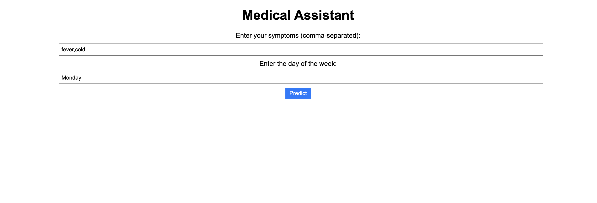
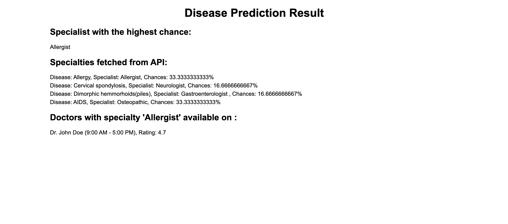

# Medical Assistant System

**Description:** Developed a medical assistant system that can predict potential diseases based on user-inputted symptoms. The system utilizes machine learning models trained on symptom data to make these predictions. Once a disease is predicted, the system recommends suitable doctors by matching the required specialists with doctors in a healthcare provider database. The recommendations are further filtered based on the user's preferred day for an appointment. Additionally, the system may incorporate user ratings or reviews of doctors to provide more personalized recommendations. The solution is implemented as a Flask web application with a user-friendly interface, allowing users to input their symptoms and desired appointment day, and displaying the predicted disease, specialist, and recommended doctors.

## Technologies Used:

- Python as the primary programming language
- Flask web framework for building the application
- Machine learning libraries like scikit-learn, TensorFlow, or PyTorch for disease prediction models
- MongoDB for storing healthcare provider data (specialties, schedules, ratings)

## Steps to setup and run the project

1. Clone or download the project repository
2. run the main.py in the terminal

```
python main.py
```

3. now run the app.py file in another terminal
```
python app.py
```

## Screenshots:

### System asking for input of Symptoms



### matched Doctor being given as output 


